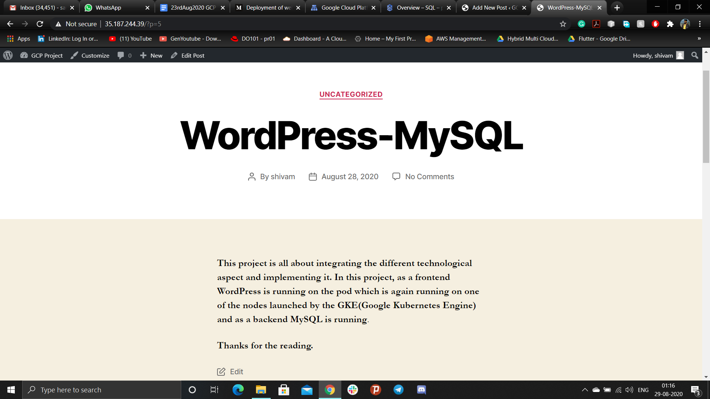

## Deployment of Web-server and Database on Google Cloud Platform using Kubernetes and MySQL
*In this project web-server as a front-end is launched on the pod which is running on one of the node launched by the GKE(Google Kubernetes Engine) which is further integrated by the MySQL database as a backend. These two services i.e. GKE and MySQL is running on two different projects(developer and production) in two different VPC which is connected by VPC peering. Pods running on different nodes is connected to the Load Balancer to manage the incoming traffic form the client.*

### Task Synopsis
```
1. Create multiple projects namely developer and production
2. Create VPC network for both the projects
3. Create a link between both the VPC networks using VPC Peering
4. Create a Kubernetes Cluster in developer project and launch any web  application with the Load balancer
5. Create a SQL server in the production project and create a database
6. Connect the SQL database to the web application launched in the Kubernetes cluster

Note :
1) For those who are using Qwiklab they can use single project for both developer and production environment
2) You can also create the Database using the AWS Cloud
3) The same can also be implemented using Terraform
```

### Important Terms:
**1. GCP:** Google Cloud Platform, offered by Google, is a suite of cloud computing services that runs on the same infrastructure that Google uses internally for its end-user products, such as Google Search, Gmail, file storage, and YouTube.

**2. GCP Projects:** It is simply a way to organize resources from a billing and permissions perspective, and each project has its own VPC network(s) isolated from other projects in GCP.

**3. GCE:** Google Compute Engine (GCE) is the Infrastructure as a Service (IaaS) component of Google Cloud Platform which is built on the global infrastructure. It enables users to launch virtual machines (VMs) on demand. VMs can be launched from the standard images or custom images created by users.

**4. VPC** Virtual Private Cloud (VPC) is a global private isolated virtual network partition that provides managed networking functionality for your Google Cloud Platform (GCP) resources.

**5. VPC Peering:** Google Cloud VPC Network Peering allows internal IP address connectivity across two Virtual Private Cloud (VPC) networks regardless of whether they belong to the same project or the same organization. VPC Network Peering enables you to connect VPC networks so that workloads in different VPC networks can communicate internally. Traffic stays within Google's network and doesn't traverse the public internet.

**6. GKE:** Google Kubernetes Engine (GKE) is a managed, production-ready environment for running containerized applications.

**7. MySQL:** Cloud SQL for MySQL is a fully-managed database service that helps you set up, maintain, manage, and administer your MySQL relational databases on Google Cloud Platform.

**8. Cloud Shell:** Cloud Shell provides you with command-line access to your cloud resources directly from your browser. You can easily manage your projects and resources without having to install the Google Cloud SDK or other tools on your system.

### Implementation:
1. Create two separate projects for the developer and production environment i.e. devproject and prodproject.


2. Creating separate VPC in developer and production projects i.e. devvpc and prodvpc. Also create a subnet for each one of the VPC's.
> - Developer VPC consists the subnet, devsubnet in region asia-southeast1 with IP address ranges 10.0.1.0/24.


> - Production VPC consists the subnet, prodsubnet in region us-east1 with IP address ranges 10.0.2.0/24.


3. Create a VPC peering between both the VPC's for internal connectivity which provides extra security and reliability.
> - VPC peering from developer VPC to production VPC


> - VPC peering from production VPC to developer VPC


4. Creating Kubernetes cluster in developer project using GKE(Google Kubernetes Engine) service.
> - In cluster basics, provide name of the cluster and the region in which cluster is created.


> - Specify no. of slave nodes per region


> - Specify machine specification and the size of the disks.


> - Set the networking for the GKE which specifies in which vpc it will be launched


> - Kubernetes cluster launched successfully in GCP in developer VPC using GKE


> - VMs launched in the k8s cluster using GKE


> - Connecting k8s cluster from cloud shell in GCP


> - Connecting to the GKE using cloud shell and checking no. of nodes running in the k8s cluster using "kubectl" command.


> - Launching pod by creating deployment using image wordpress and also creating a load balancer for managing the traffic to the web-server running at port 80.


> - Load balancer created using cloud shell can also be verified via this


5. Creating a database server using MySQL as a backend for webserver in production VPC
> - Database is provided by SQL service in GCP


> - Choose the MySQL Option


> - Provide Instance id, root user password and region


> - SQL Instance sucessfully launched


> - Create a database to store the webserver data


> - Database sucessfully created.


> - Configure the firewall network connection which allows webserver to connect to the MySQL database.


> - Check the connectivity and reliablity of the sql database from the cloud shell.


6. Launch the webserver using the load balancer IP:Port


> - Specify the sql database, username(i.e. root), password, database host(i.e. MySQL instance ip) in order to connect with web server.


> - Webserver successfully connected to the sql database.


> - Successfully, hosted the Web page on the web server.



7. Delete the entire GKE infrastructure using cloud shell


### Thanks for reading.
